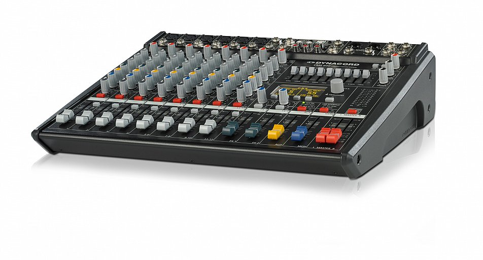

# Dynacord CMS 600-3 USB Capture

This repository contains a capture of USB communication between a Windows host and a Dynacord CMS 600-3 mixer.

This 8-channel mixer is available in two hardware variants: the new one is USB class-compliant, but the old one uses a [Ploytec]https://www.ploytec.com/) USB audio interface card, and drivers for it are no longer available on modern versions of MacOS nor Apple-chipset Mac hardware like the M1-M4. (See [the note here](https://products.dynacord.com/binary/Technical_Note_USB%20drivers_Powermate-CMS_EN.pdf): "drivers not listed are not available")

The [Ploytec REVIVAL](https://www.ploytec.com/revival/) firmware does not yet support this hardware. The other hope is that a pure software driver like [mischa85/Ozzy](https://github.com/mischa85/Ozzy) (formerly snd-xonedb4; work in progress at [dominics/Ozzy](https://github.com/dominics/Ozzy)) may one day add support.

The capture is provided as a .pcap file, captured using USBPCap, on Windows (where there is still a working driver).

The Dynacord CMS 600-3 uses the USB Vendor ID of `0x0562` and Product ID of `0x03eb`
